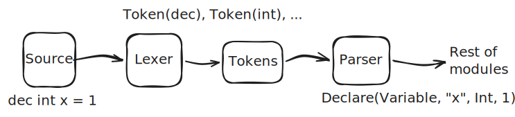
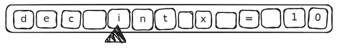
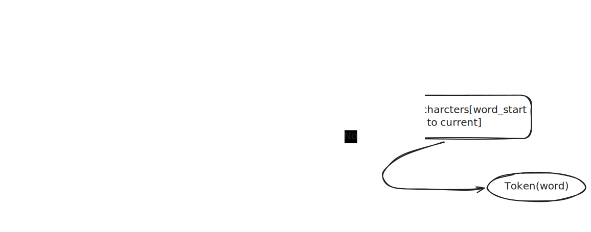
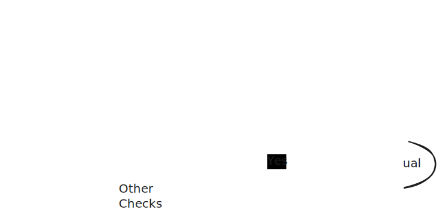

The Lexer also known as a lexical analyzer

_before we start: This is a simplified conceptual walkthrough - `rl`-lang's actual lexer differs in several ways_

How does it work?

First, it reads a stream of characters from source files. then returns tokens



For example, we have this code snippet:

```
dec int x = 1
```

If we used it directly, the compiler/interpreter would get confused. Since the parser should make grammar based on rules that are applied to tokens for the snippet to break it down

```
Token(Dec)
Token(Int)
Token(Identifier(x))
Token(Assign)
Token(Number(1))
```

Now, when making rules via a parser to make valid code It will be much easier.

How was it done?

First, let's list what we need:

- source file that contains our target that we should convert to tokens
- rules for lexer to recognize keywords and literals

Let's take this, for example.

```
dec int x = 10
x += 12
```



We need to break this down, but how?

Well, we need to make tokens first to recognize the keywords like "dec" for declaration and "int." We also need to recognize "=" and "+=" correctly. The same goes for x, 10, and 12.

For starting this, we will work on the character level. We should read the file as characters and decide the rules to output the correct token. For example, "dec" and "int" - those two are keywords; both are words. So we need to read the letters d, e, and c to output the Dec keyword token. But if we add a new keyword, for example, "float," we need to read the characters (character by character) to return the "float" keyword token. It will take much time that way.

We can detect if it is a character that falls between a and z or A and Z. So, for example, we made the snippet provided earlier as a file, and we gave that file as a list of characters to the program. The program should have that rule we said earlier (to detect if the character we are currently at is a to z or A to Z). And if the next character is, for example, a white space, tab (\t), or new line (\n), we end detection of the word.

so

```rust
let mut start_index = 0;
let mut current_index = 0;

// We check if the character we are at is in the characters list
// Is it a valid word start or not?
if characters[current_index].is_ascii_alphabetic() {
    // If it is valid now, we set the start of our word as the same current index.
    start_index = current_index;

    // While it is a word not separated by spaces, do the following:
    while characters[current_index] != ' '
        && characters[current_index] != '\t'
        && characters[current_index] != '\n'
    {
        // Now we increase the index to advance the pointer to the characters list
        current_index += 1;
    }

    // Now the word ended; we should return the word.
    // We take the characters from the starting word index to the current index.
    let word: String = characters[start_index..current_index].iter().collect();
}
```

We will need to match the words now.

```rust
match word.as_str() {
    "dec" => Token::Dec,
    "int" => Token::Int,

    // If not a recognized keyword, then it is an identifier.
    _ => Token::Identifier(word),
}
```

with this instead of manually checking for each character We match the full word instead. When adding a new keyword, it will be like this:

```rust
match word.as_str() {
    "int" => Token::Int,
    "float" => Token::Float,
    // ...
}
```



That means our snippet recognized words correctly; the same will be applied for numbers.

```rust
let mut start_index = 0;
let mut current_index = 0;

if characters[current_index].is_ascii_digit() {
    start_index = current_index;

    while characters[current_index] != ' '
        && characters[current_index] != '\t'
        && characters[current_index] != '\n'
    {
        current_index += 1;
    }

    let number: i64 = characters[start_index..current_index]
        .iter()
        .collect::<String>()
        .parse()
        .unwrap();

    // and return the token
    Token::Number(number);
}
```

What would be left are = and +=. Those will be matched by character, so we can add more rules to them.

```rust
match character {
    '=' => Token::Equal,
    '+' => {
        if next_character == '=' {
            Token::PlusEqual
        } else {
            Token::Plus
        }
    }

    ' ' | '\n' | '\t' => {
        // we skip
    }
}
```



so now we get

```
Token(Dec)
Token(Int)
Token(Identifier("x"))
Token(Equal)
Token(Number(10))
Token(Identifier("x"))
Token(PlusEqual)
Token(Number(12))
```

That's it for the basic tokenizer.
